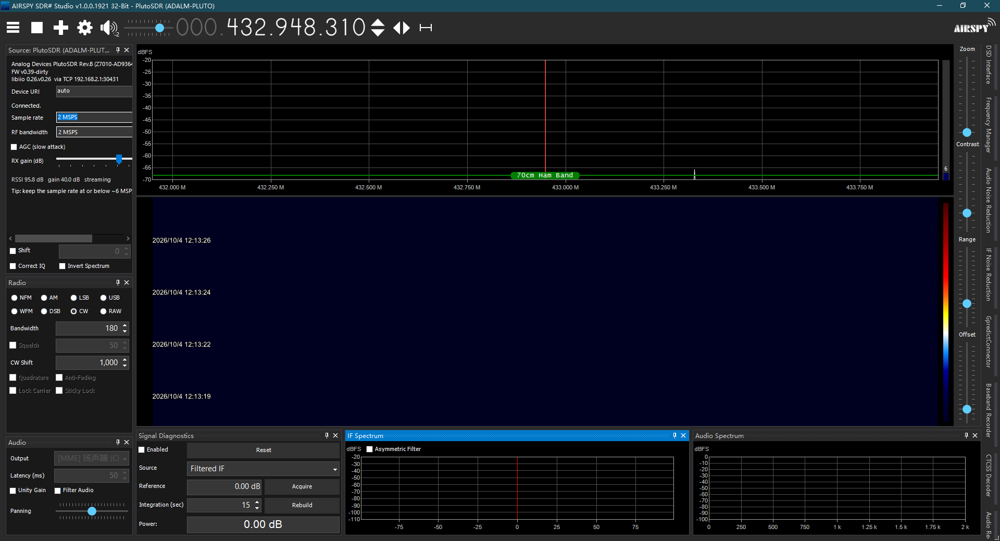
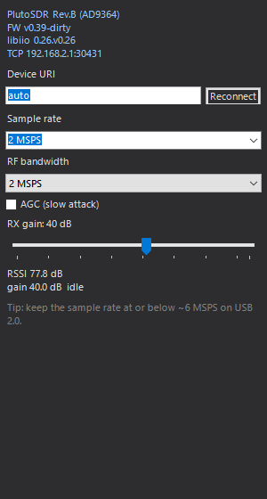

# SDR# PlutoSDR plug-in

An ADALM-PLUTO receive frontend for **AIRSPY SDR# Studio v1.0.0.1921 (32-bit)**.

PlutoSDR shows up in SDR#'s **Source** menu like any built-in radio, streams IQ at full rate, and
brings its own source panel for tuning, sample rate, RF bandwidth, gain/AGC and live RSSI.



> 中文说明见 [README.zh-CN.md](README.zh-CN.md)。

---

## Status

Verified against real hardware — *Analog Devices PlutoSDR Rev.B (Z7010-AD9364), firmware
v0.39-dirty* — sustaining **2.005 MSPS** inside SDR# with no dropped samples, measured from the
plug-in's own block counters.

## Features

- Appears in the **Source** menu as *PlutoSDR (ADALM-PLUTO)*; SDR# treats it exactly like a
  built-in source.
- Full-rate IQ streaming with 12-bit → `Complex` conversion.
- Tuning over the whole 70 MHz – 6 GHz range of the AD9364, with the limits read from the device.
- Sample rate 0.5 – 30.72 MSPS and RF bandwidth 0.2 – 56 MHz, both validated against the hardware's
  reported ranges.
- Manual gain (−1 … 73 dB) or AGC (`slow_attack`).
- Live telemetry: model, firmware, serial, libiio version, transport, RSSI and current gain.
- Two transports, chosen automatically; the default needs **no native libraries**.
- No native redistribution: the plug-in does not use the bundled `libiio.dll` at all.

## Requirements

| | |
|---|---|
| SDR# | 1921, **32-bit** (`SDRSharp.dotnet9.exe` / `SDRSharp.dotnet8.exe`) |
| .NET | the matching **x86** desktop runtime (8 or 9) — normally already present if SDR# runs |
| PlutoSDR | connected over USB, with its RNDIS network adapter up and `192.168.2.1:30431` reachable |

The plug-in is 32-bit because SDR# 1921 is a 32-bit process.

## Install

### From a release (no build tools needed)

Two files are all it takes:

```
<SDR# folder>\
  SDRSharp.dotnet9.exe
  Plugins\
    PlutoSDR\                          <- folder name is up to you
      SDRSharp.PlutoSDR.dll
      MagicLine.txt
```

`MagicLine.txt` is how SDR# discovers a plug-in and must contain exactly one line:

```xml
<add key="PlutoSDR" value="SDRSharp.PlutoSDR.PlutoSDRPlugin,SDRSharp.PlutoSDR" />
```

Do **not** put `SDRSharp.Radio.dll`, `SDRSharp.Common.dll` or `SDRSharp.PanView.dll` in there. SDR#
already provides them, and a second copy fails with
`Assembly with same name is already loaded`.

### From source

```powershell
git clone <this repo>
cd <repo>

# one step: extracts the host assemblies if needed, builds, installs
powershell -ExecutionPolicy Bypass -File tools\deploy.ps1 -SdrSharpDir "C:\SDRSharp"
```

Or do it by hand:

```powershell
# SDR# host assemblies are not distributed here - unpack them from your own copy of SDR#
powershell -ExecutionPolicy Bypass -File tools\extract-refs.ps1 -SdrSharpDir "C:\SDRSharp"

dotnet build src\PlutoSDR\SDRSharp.PlutoSDR.csproj -c Release
# then copy the DLL plus MagicLine.txt into <SDR#>\Plugins\PlutoSDR\
```

See [docs/DEPLOY.md](docs/DEPLOY.md) for the full walkthrough, including expected log output and a
troubleshooting table.

## Usage

1. Start SDR#.
2. **Source** menu → **PlutoSDR (ADALM-PLUTO)**.
3. Press **Play**.

The plug-in is deliberately **passive**: it registers the source and nothing else. It never selects
a source, never starts reception and never writes to SDR#'s configuration. Everything that happens
is either your click on the Source menu or a button in the plug-in panel.

The plug-in's own panel (SDR# **Display** menu → plug-ins) shows the registration status, the
host's current source, and two buttons: *Use PlutoSDR as the source now* and *Re-register the
frontend*.

### Source panel

The panel lays itself out as a single full-width column, so it adapts to whatever width SDR#'s
source pane has instead of overflowing it with a horizontal scrollbar:



| Control | Notes |
|---|---|
| Device URI | `auto` (default), `ip:<host>`, or `usb` |
| Sample rate | 0.5 … 30.72 MSPS, free text entry |
| RF bandwidth | 0.2 … 56 MHz |
| AGC (slow attack) | switches `gain_control_mode` |
| RX gain | manual `hardwaregain`, −1 … 73 dB |
| Status line | model, firmware, serial, libiio version, transport; RSSI and gain while streaming |

Settings are stored in `Plugins\PlutoSDR\PlutoSDR.config`:

```ini
DeviceUri=auto
SampleRate=2000000
Bandwidth=2000000
GainDb=40
Agc=false
Frequency=432948310
```

SDR# must be closed normally for changes to be written; force-killing the process skips saving.

## How it works

### Registering a frontend SDR# does not know about

SDR# 1921 has no public extension point for hardware frontends. Its built-in sources are registered
by name from `MainForm.InitializeGUI()` through the private instance method

```csharp
void LoadSourceType(string name, Type type, int rank)
```

which fills the frontend table and appends the matching entry to the Source menu. Plug-ins are
loaded later, from `MainForm_Load`, so this plug-in invokes that same method by reflection. From
then on the host treats PlutoSDR like a built-in source: `Activator.CreateInstance` on the type,
then the radio interfaces are probed with `is` checks.

Three details were needed to make that work, each verified against the shipping binary:

1. **`ISharpControl` is not the form.** SDR# hands plug-ins a `SharpControlProxy` that merely
   forwards to `MainForm`; the form is recovered from the proxy, falling back to
   `Application.OpenForms`.
2. **The menu slot matters.** A selected source is resolved as
   `sourceMenuItem.DropDownItems[selected + 2]`, but `LoadSourceType` appends and SDR# adds its
   *Baseband from Sound Card* entry **after** the built-in frontends. A plain append therefore lands
   one slot too far right, the host looks up the wrong name, fails and opens nothing. The entry is
   moved to `builtinCount + 2` right after registration.
3. **Some host APIs need the frontend to look a certain way.** `ISpectrumProvider`,
   `IControlAwareObject` and `ISampleRateChangeSource` are optional; implementing them is what makes
   the spectrum width, the host control object and sample-rate changes propagate correctly.

### Transports

* **`ip:` — default.** The Pluto runs the same IIOD daemon on `192.168.2.1:30431` over its own
  USB-Ethernet interface. This sustains the full sample rate and needs no native libraries.
* **`usb` — opt-in.** Speaks IIOD over the interface whose USB string descriptor is `"IIO"`, using
  vendor control requests only for pipe reset/open and bulk transfers for the protocol — exactly
  what libiio's USB backend does.

  It is **not** the default because the 32-bit `libusb-1.0.dll` (1.0.21) that SDR# ships raises an
  access violation while enumerating this composite device. libusb logs
  `device '\\.\USB#VID_0456&PID_B673&MI_02#...' is no longer connected!` and the process dies; the
  64-bit libusb 1.0.26 used by libiio has no such problem. Use `usb` only after replacing SDR#'s
  `libusb-1.0.dll` with a newer 32-bit build.

The bundled 32-bit `libiio.dll` is not usable either: it needs a 32-bit `libxml2.dll` and
`libserialport-0.dll`, which are not present on a stock Windows install. Talking IIOD directly
removes that dependency entirely.

The IIO interface is located by walking the raw configuration descriptor for a string descriptor
equal to `"IIO"`. Do not hardcode an interface number: on the tested unit it is interface **5**, not
the 1 that is usually assumed.

### The IIOD protocol

`src/PlutoSDR/Iio/IiodClient.cs` implements the text protocol shared by libiio's USB and network
backends:

| Command | Purpose |
|---|---|
| `VERSION` | backend version |
| `PRINT` | context XML, used to discover devices and channels |
| `READ <dev> [INPUT\|OUTPUT <chn>] <attr>` | attribute read |
| `WRITE <dev> [INPUT\|OUTPUT <chn>] <attr> <len>` + payload | attribute write |
| `OPEN <dev> <samples> <mask>` | allocate the kernel buffer |
| `READBUF <dev> <bytes>` | pull samples |
| `CLOSE <dev>` | release the buffer |

The context XML drives discovery of `ad9361-phy` / `cf-ad9361-lpc`, the RX LO channel, the gain
channel and the ordered scan channels that form the buffer mask.

### Hardware data path

Two facts are easy to get wrong and were both found the hard way:

* **A `READBUF` must drain a whole kernel buffer.** The DMA engine recycles a buffer as soon as it is
  full, so requesting less silently discards the remainder. A quarter-sized read measures exactly
  0.5 MSPS out of a 2 MSPS stream. The block size is therefore `BufferSamples × 4` bytes.
* **The channel mask always precedes the first data chunk** of a `READBUF` response, whether or not
  the caller wants it. Skipping it shifts every later read by 9 bytes and desynchronises the
  protocol after the first block.

Samples arrive as `le:S12/16>>0` — right-justified 12-bit, saturating at ±2048 (confirmed by driving
the gain to 73 dB and observing the clip point). They are scaled by 1/2048 into
`SDRSharp.Radio.Complex`.

## Known limitations

* **SDR# may start on "Baseband from Sound Card" after you have used PlutoSDR once.** SDR# persists
  the selected source as an index and reloads it with `selected = (stored > count) ? count : stored`.
  A third-party source sits at index `count`, which survives that clamp, and at the moment the check
  runs the plug-in has not registered yet — so `SourceIsSoundCard` (`selected >= count`) reports
  true. Nothing is broken; just pick **PlutoSDR** from the Source menu again. Fixing it would mean
  rewriting `iqSource` in SDR#'s own configuration, which this plug-in deliberately does not do.
* The `usb` transport needs a newer 32-bit `libusb-1.0.dll` than SDR# ships (see above).
* Transmit is not implemented; this is a receive-only frontend.
* USB 2.0 realistically tops out around 6 MSPS for 2-channel 16-bit IQ. 2–5 MSPS is the comfortable
  range.

## Troubleshooting

Full table in [docs/DEPLOY.md](docs/DEPLOY.md). The short version:

| Symptom | Check |
|---|---|
| No *PlutoSDR* entry in the Source menu | `MagicLine.txt` present and spelled exactly right; the DLL is x86; no stray `SDRSharp.*.dll` next to it; see `PluginError.log` |
| Entry present, source stays unconnected | `Plugins\PlutoSDR\PlutoSDR.log`; look for `Open('...') failed` |
| `Could not open the PlutoSDR` | `Test-NetConnection 192.168.2.1 -Port 30431`; check the RNDIS adapter; verify with `iio_info.exe -s` |
| SDR# dies instantly with `0xC0000005` | `DeviceUri` is set to `usb`. Set it back to `auto` |
| Spectrum empty | press **Play**; frequency within 70 MHz – 6 GHz; raise the gain |
| RSSI pinned near 100 dB | input saturated — lower the gain or enable AGC |

There is also a standalone diagnostic that exercises the whole device layer without SDR#:

```powershell
dotnet run --project tools\PlutoIioTest -c Release -- "C:\SDRSharp" ip:192.168.2.1 40 200
```

It connects, configures the hardware, reads the real sample-rate/LO registers back, streams blocks
and reports the effective sample rate, so you can tell a real 2 MSPS from a link that is quietly
dropping three quarters of the samples.

## Building

```powershell
dotnet build src\PlutoSDR\SDRSharp.PlutoSDR.csproj -c Release
```

* Target `net9.0-windows`, platform `x86` (SDR# 1921 is a 32-bit process).
* `src\PlutoSDR\refs\` holds the SDR# host assemblies used **for compilation only**, referenced with
  `Private=false` so they are never copied into the output. That folder is git-ignored; create it
  with `tools\extract-refs.ps1`, which unpacks the assemblies from your own
  `SDRSharp.dotnetN.exe` and verifies each one by reading its assembly metadata.

There is no CI build for the same reason: the host assemblies cannot be redistributed, so a runner
cannot compile the project without them.

## Diagnostics

`Plugins\PlutoSDR\PlutoSDR.log` records registration, the resulting Source menu layout, transport,
device configuration, stream start and periodic block counts. SDR# swallows exceptions raised while
opening a source, so this file is the only way to see what the frontend actually did inside the
running application.

A healthy log looks like this:

```
=== plug-in Initialize ===
host control object = SDRSharp.SharpControlProxy, main form = SDRSharp.MainForm
frontend registered as 'PlutoSDR (ADALM-PLUTO)' (built-in sources: 11)
Source menu now: ... | [13] 'PlutoSDR (ADALM-PLUTO)' tag=11 | [14] 'Baseband from Sound Card' tag=<null>
opened Analog Devices PlutoSDR Rev.B (Z7010-AD9364) fw v0.39-dirty via TCP 192.168.2.1:30431; rate=2000000 LO=100000000 gain=40dB
streaming started: buffer 61440 samples (245760 bytes per block), rate 2000000
first block delivered to SDR#: 61440 IQ samples at 2000000 SPS
```

`frontend registered` → registration worked. `[13] ... tag=11` → the menu slot is correct.
`opened ... via TCP` → the hardware answered. `first block delivered` → IQ is really flowing into
SDR#'s receive chain.

## Project layout

```
src/PlutoSDR/
  PlutoSDRPlugin.cs        ISharpPlugin entry point and host registration
  PlutoSDRIO.cs            the SDR# frontend plus the IQ streaming thread
  PlutoDevice.cs           discovery, attributes, kernel buffering
  PlutoControlPanel.cs     source configuration panel
  PlutoSettings.cs         settings store
  PlutoLog.cs              rolling log
  Iio/
    IiodClient.cs          IIOD protocol over a buffered byte stream
    UsbTransport.cs        libusb transport (opt-in)
    TcpTransport.cs        TCP transport (default)
    LibUsb.cs              libusb P/Invoke surface
    IIioTransport.cs
  MagicLine.txt            plug-in registration line for SDR#
tools/
  extract-refs.ps1         unpack host assemblies from a local SDR#
  deploy.ps1               build and install in one step
  PlutoIioTest/            standalone device-layer diagnostic
  PanelShot/               renders the source panel at several widths, to check the layout
docs/
  DEPLOY.md                deployment walkthrough
```

## Credits and licence

MIT — see [LICENSE](LICENSE). Third-party, trademark and redistribution notes: [NOTICE.md](NOTICE.md).

Not affiliated with Analog Devices or Airspy. The plug-in links against SDR# host assemblies at
compile time; those are Analog Devices property, are not distributed here, and must be extracted
from your own SDR# installation.
